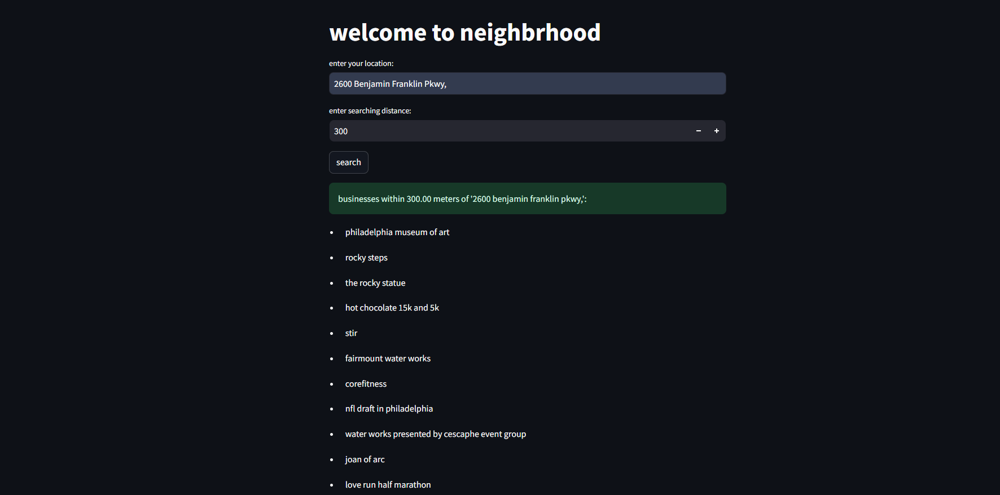
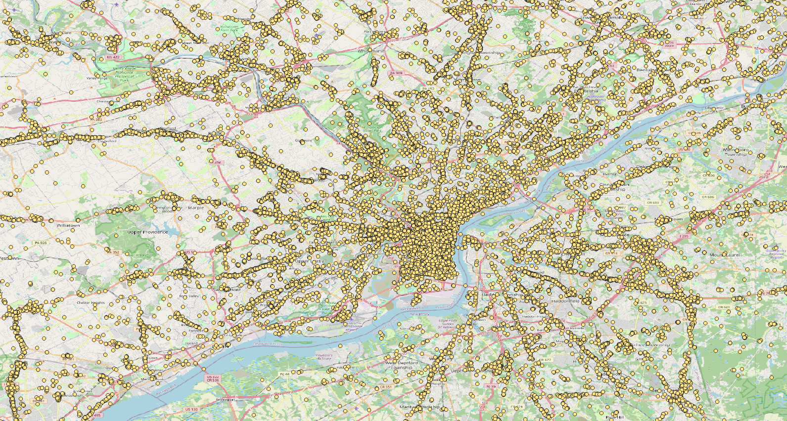
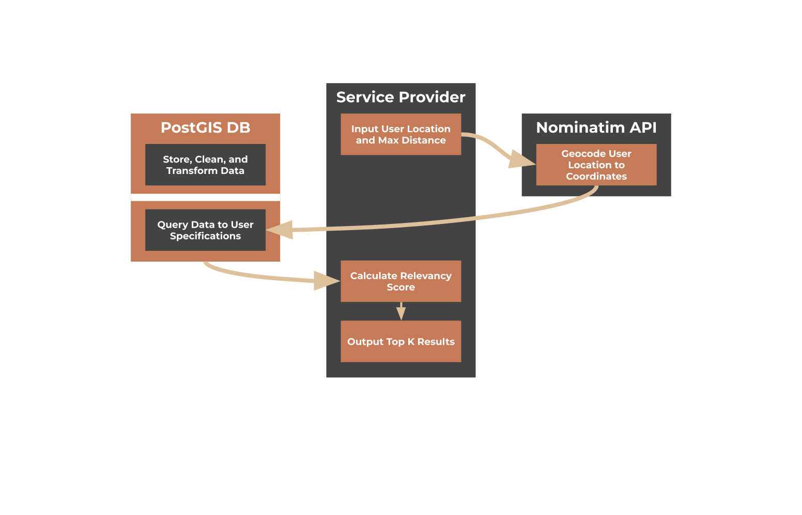

# Neighbrhood: Local Business Recommendation System

In this project, we designed a recommendation system that takes in a user-provided address and radius, and outputs a list of the top K recommended businesses using Yelp’s dataset of businesses. The dataset can be found [here](https://www.kaggle.com/datasets/yelp-dataset/yelp-dataset).

To store the dataset, we used PostgreSQL and PostGIS. The database stores the geographical locations of the businesses, along with reviews and other data. To handle user queries of addresses, we used the Nominatim API ([link](https://nominatim.openstreetmap.org/ui/search.html)) to convert this input into coordinates that can be interfaced with the database. We used Python as the service provider and Streamlit to render the UI of the project.

## Architecture

### Data Collection
We searched for many datasets that included geospatial data and chose to use an official Yelp Dataset on Kaggle, which includes data related to businesses in major US and Canadian cities.

### Data Storage
We decided to use PostGIS, an extension of PostgreSQL, due to its geospatial functionalities. We hosted the database locally for testing.

### Data Cleaning
- We focused on one city in the database, so we removed all businesses outside of the Philadelphia area.
- We also removed all businesses that were closed.
- For simplicity, we removed irrelevant columns for testing, such as hours open, attributes, and categories.

### Data Transformation
We included a Relevancy Score as a feature so that if the user enters a large distance, the service would display the 15 most popular locations instead of potentially hundreds of businesses.

### EDA (Exploratory Data Analysis)
We used QGIS, a geospatial visualization tool, to view a heatmap of businesses within the city. We observed that businesses followed a grid-like structure, with more businesses near highways and main roads.

### Search Algorithm
We utilized PostGIS to search for K nearest locations within a distance. Using the relevancy score, we displayed the most popular results and capped it at 15 queries for optimal search performance.

### Deployment
We deployed our framework on Streamlit for a clean and simple UI.
